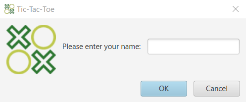
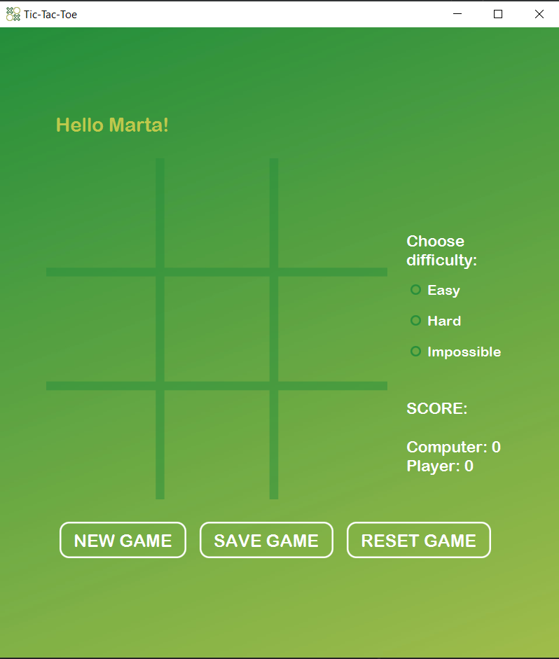
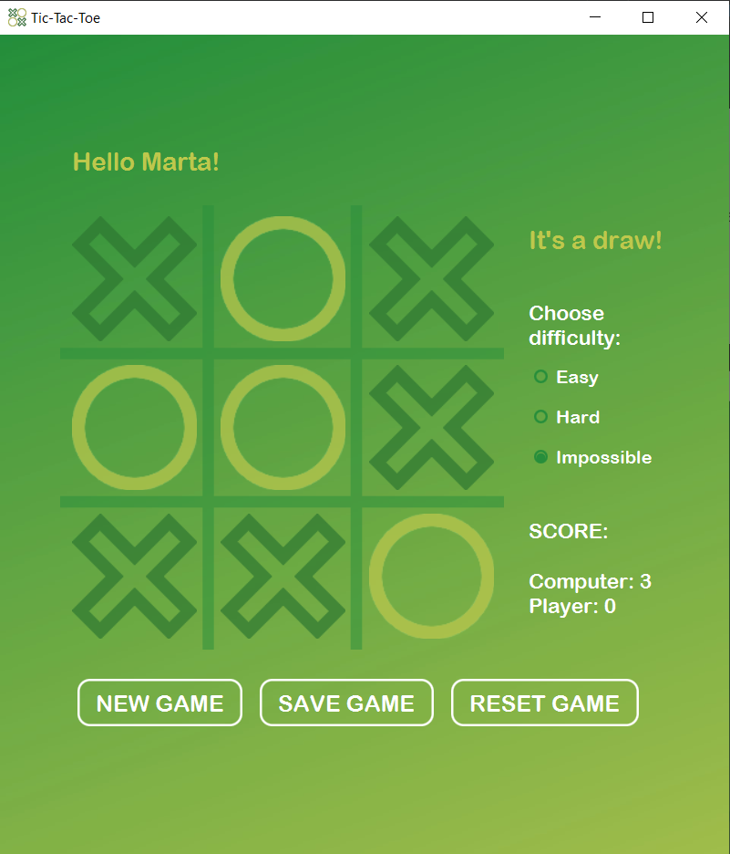
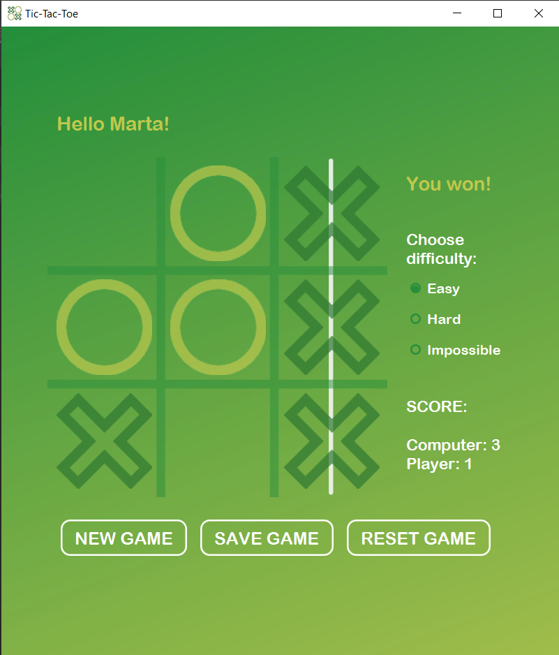

# Tic-Tac-Toe

Player vs computer tic-tac-toe game developed using JavaFX. Different difficulty levels (including unbeatable one) and ability to save current game.

## How it works

* First user is asked to enter a name.

* Player can choose to play the game on three modes: easy, hard and impossible. There is a board keeping a current score that can be reset using "RESET GAME" button. There is also a possibility to save the game and load it at the next launch. "NEW GAME" button allows the player to empty the board and start another game.

* The impossible mode is unbeatable.

* After either the player or the computer get three symbols in a row, the game is finished.

